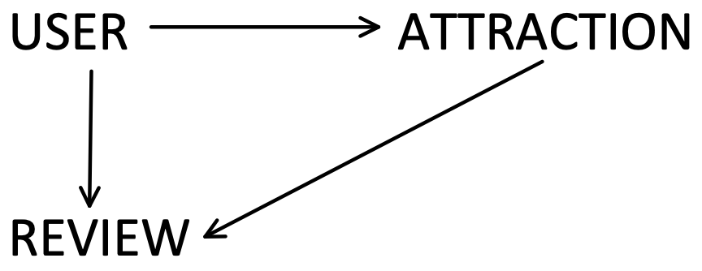

# Stuff To Do Map - Backend
_An app to find something to do no matter where you are_

This is the repository for the backend of this application. You can find the repository for the frontend [here](https://github.com/tylergreason/Stuff_To_Do_Map_Frontend). 

## Background 
Stuff To Do Map was created as my final project for Flatiron School’s Immersive Software Engineering program. I was inspired to create it after traveling abroad in the summer of 2019. As I was journeying to new cities and looking online for things to do, I found a lack of sites that let me find things to do around my current location. I wanted to see a map, know where I was, and know what was around me, without having to wade through multiple listacles and look up addresses myself. Thus, Stuff To Do Map was born. 

## Functionality 
Users can: 
- View a map of the world and see all attractions made by users or received from the OpenTripMap API. 
- Find their location on the map with the click of a button. 
- Click on attraction markers on the map to find out more about that attraction. 
- Use the app in both mobile and desktop modes. 
- Pan and zoom across the map to see only attraction markers within the bounds of the map’s current view. 
- Create an account with details about themselves. 
- Edit their account details including email address and password, with password verification required for all account changes. 
- Delete their account.
- Add new attractions to a map for all other users to see. Attractions include their latitude and longitude, address, name, and a short description. 
- Edit the names and descriptions of attractions they have made. 
- Delete attractions they have made. 
- Write attraction reviews, which include a 1-10 star rating.
- Delete their reviews. 

## Association Wireframes 

- User has many reviews 
- Review belongs to user 
- User has many attractions 
- Attraction belongs to user 
- Attraction has many reviews
- Review belongs to attraction 

## Tools and Technologies 

### Backend Technologies:  

- [Ruby 2.6](https://www.ruby-lang.org/en/), [Ruby on Rails 6.0.2.2](https://rubyonrails.org/) - Used to create the model and controller portions of the MVC. Currently hosted on Heroku. 
- [DOTENV](https://github.com/bkeepers/dotenv) - Used to store environmental variables such as API keys during development. 
- [JSON Web Tokens](https://jwt.io/) - Used to securely prevent the need to re-authentice the user while they are logged in.
- [BCrypt 3.1.7](https://github.com/codahale/bcrypt-ruby) - Used to securely store user information on the backend. 
- [Faker](https://github.com/faker-ruby/faker.git) - Used to quickly create fake data for testing. 

### Frontend Technologies: 

- HTML, CSS, Javascript 
- [React JS](https://reactjs.org/) - Used for quick development time, reusable components, and ease of porting to mobile if I choose to later. Used for the view portion of the MVC. 
- [React Redux](https://react-redux.js.org/introduction/quick-start) - Used for keeping a single store shared amongst whichever components need it. This drastically reduced development time. 
- [React Router](https://reacttraining.com/react-router/) - Used to give my single page application a kind of traditional website feel for its routes. 
- [Animate CSS](https://daneden.github.io/animate.css/) - Used for pleasant animations for elements while they load, but overtime I removed many instances of its use because it felt too ‘busy’. 
- [Google Material Icons](https://material.io/resources/icons/?style=baseline) - Used some of their map icons on the map pages. Easily styled with CSS.
- [Leafet JS](https://leafletjs.com/) - Used to quickly create a functional map. Leaflet provides many functions that I needed out of the box such as displaying map markers, marker click functionality, bounding box, reading data from the map (lng/lat, zoom level), and more. 
- [MapBox](https://www.mapbox.com/) - The map I used to present marker data on (Leaflet does not include a map). 
- [OpenTripMap](https://opentripmap.io/product) - Used for its enormous amount of data and easy to use API. Provides data on tens of thousands of places ranging from hotels to restaurants to architecture to nature trails. I only used historical district data because anything more overcrowds the map. 
- [Nominatim](http://nominatim.org/) - Used this API to send it a set of coordinates and receive the closest address to those coordinates. This is used when users are creating markers.

## Usage 

To see how to use Stuff To Do Map yourself, check it out at [stufftodomap.com](www.stufftodomap.com)!

Otherwise, a list of examples of use are given on the frontend repository for this application found [here](https://github.com/tylergreason/Stuff_To_Do_Map_Frontend).

## Backend Challenges and What I Learned 

I learned that you should always make your API calls with the backend where you can. I learned late that you cannot store secret information from your users in the frontend of your application, so any API calls that require a secret API key were moved to the backend. And this is good practice anyway. The frontend should not be responsible for processing data sent to it like the backend should. The backend should sort and reduce data sent from an API before sending it to the frontend, releiving the frontend of that load and giving a better user experience. 

Speaking of reducing data, I learned I should have used a serializer from the beginning. I assumed that because I have only 3 simple models that I would not need a third party gem to format my returned JSON data for me and that I could just do it myself. This was true, but it is not ideal. I ended up questioning if what I was doing was correct too many times and would have saved time _and_ made my program more readable for others if I had used a serializer to start. 

## Next Steps 
 
- Utilize Fast JSON for formatting the data sent to the frontend. 
- Finish writing validations (require passwords to be 8 characters or greater, make sure emails have an @, etcetera). 
